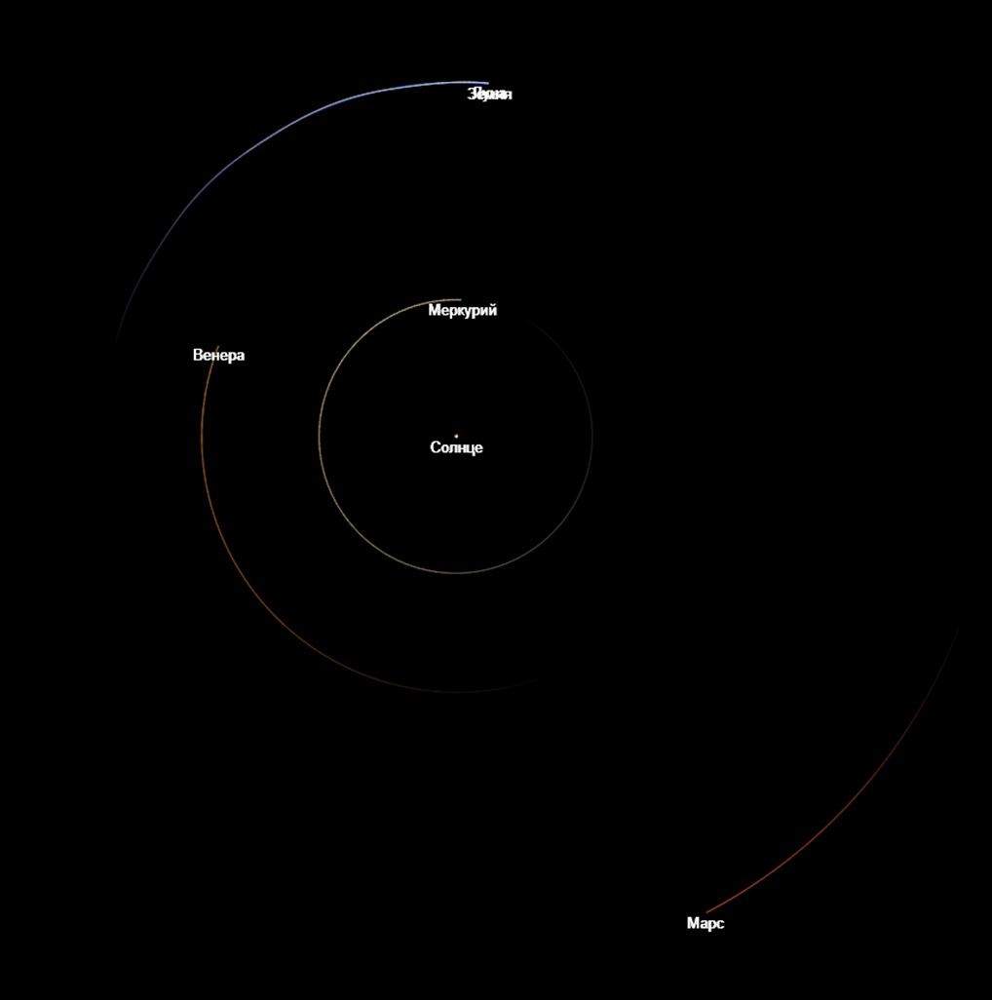
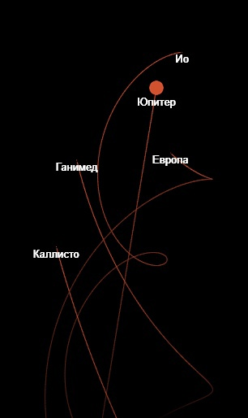

# 2DGravitySimulator
The 2D interactive simulator of gravitational interaction of cosmic bodies. The program also contains a stable interactive simulation of the main bodies of the Solar System, including all of the planets and their biggest moons.

Built with [p5.js](https://p5js.org/) library as an individual project in [Yaroslavl Urban Planning College](https://ygk.edu.yar.ru/).

**Project manager**: [Sheremetyeva Natalya Vladimirovna](https://n-sheremetyeva.jimdofree.com/), mathematics teacher of the highest category at the Yaroslavl Urban Planning College.

*Pic. 1. The earth group planets in the Solar System simulation created with this simulator.*

*Pic. 2. Jupiter and its moons in the Solar System simulation created with this simulator.*

## How to run
1. Download all project files.
2. Open 'index.html' file.
- To run the Solar System simulation, click "run the simulator" ("запустить симулятор") at the "index.html" page, then click "built-in simulations" ("готовые симуляции"), then click "Solar System" ("Солнечная Система").

## How to use
The program has several modes.

### Adding bodies
1. Click the "add mode" ("режим добавления") button.
2. Click in the place where you want to create a body.
3. Click in the place where the vector of the initial velocity of the body will end.
4. Press the mode button again to exit it and run the simulation.
You can also run ready-made simulations by clicking on the "built-in simulations" ("готовые симуляции") button and selecting from the list.

### Moving across, zooming in and out
- To move around the simulation, use the arrows on the keyboard.
- To zoom in or out, rotate the mouse wheel.

### Altering bodies
To change space objects, click "selection mode" ("режим выбора") and click on a body. The object parameters will appear on the left. You can change them. Press the mode button again to exit it.

### Removal
To delete all objects in the simulation, click "delete all objects" ("удалить все объекты").

### Video recording
To start videotaping the simulation, click "start video recording" ("начать запись видео"). Press the button again to finish recording. Watch the video. Then click three dots button on the video player and select "download" ("скачать").

## How it works
- There are a number of bodies on the playing field that have mass, velocity vectors and coordinates. The task of the simulator is to find the coordinates of bodies and their velocities at subsequent points in time.

- These calculations are made on the basis of Newton's law of universal gravitation.
    1. Each new frame, the program finds the force of attraction (F) of each body to all other bodies on the playing field.
    2. Since F = m*a (where F is force, m is mass, a is acceleration), then a = F/m. That is, to find the acceleration of a body at a particular time, you need to divide the force (in this case, the force of attraction) acting on the body by its mass.
    3. It is known that acceleration shows the rate of speed change. Therefore, the velocity vectors of bodies change to the acceleration vector at a specific time. Hence, the change in the velocity vector = the vector of gravity / body mass.

- That is,
  
  .

## Reviews
Kalinin Dmitry Alexandrovich, a teacher of physics and astronomy at the Yaroslavl Urban Planning College, commented on the project as follows:
> "This simulator can be used to determine the flight paths of rockets, spacecraft, asteroids, comets, but without taking into account the passage near the surface of planets with an atmosphere. It is also possible to follow the trajectory of the movement of bodies relative to the Earth. It cannot be used for the movement of a system of double or multiple stars located close to each other (because there is an exchange of matter)."
